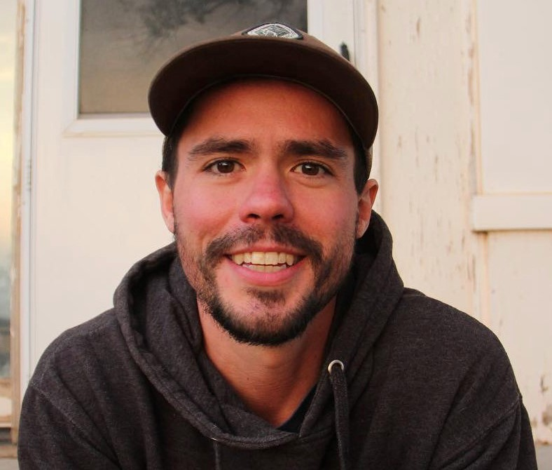

<link rel="stylesheet" href="styles.css" type="text/css">

I am a Research Fish Biologist in the Water and Watersheds Program at the U.S. Forest Service Rocky Mountain Research Station. My main research interests are conservation biology, aquatic and fisheries ecology, ecological modeling. 
   
* To learn more about my work and download publications or software, view my [CV](files/cv/maitland_cv_2024-09.pdf) and the associated [GitHub](https://github.com/bmait101) repositories
* To visit my Google Scholar page, click [here](https://scholar.google.com/citations?user=tGn-FzAAAAAJ&hl=en)
* To visit my ORCID ID page, click [here](https://orcid.org/0000-0002-4491-5064)
* To reach out, please email me at Bryan.Maitland@usda.gov